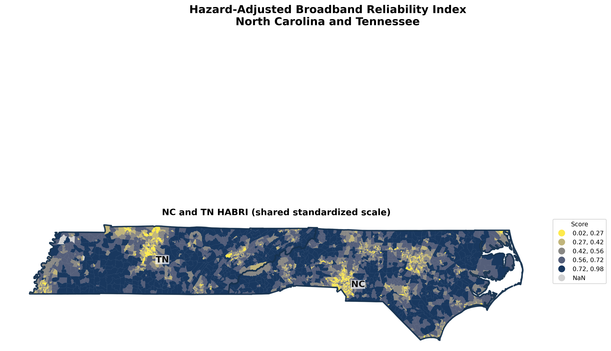
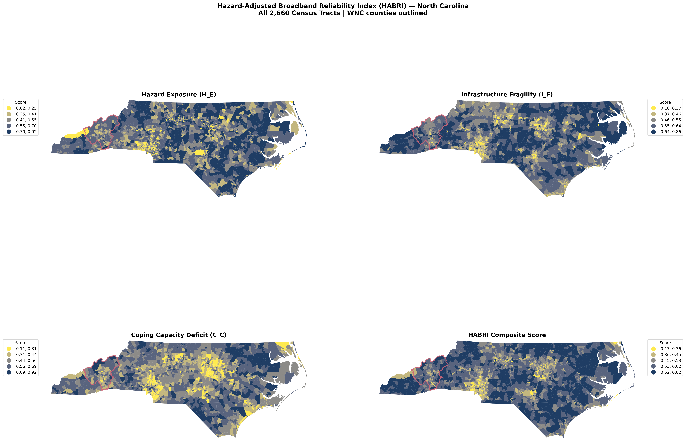
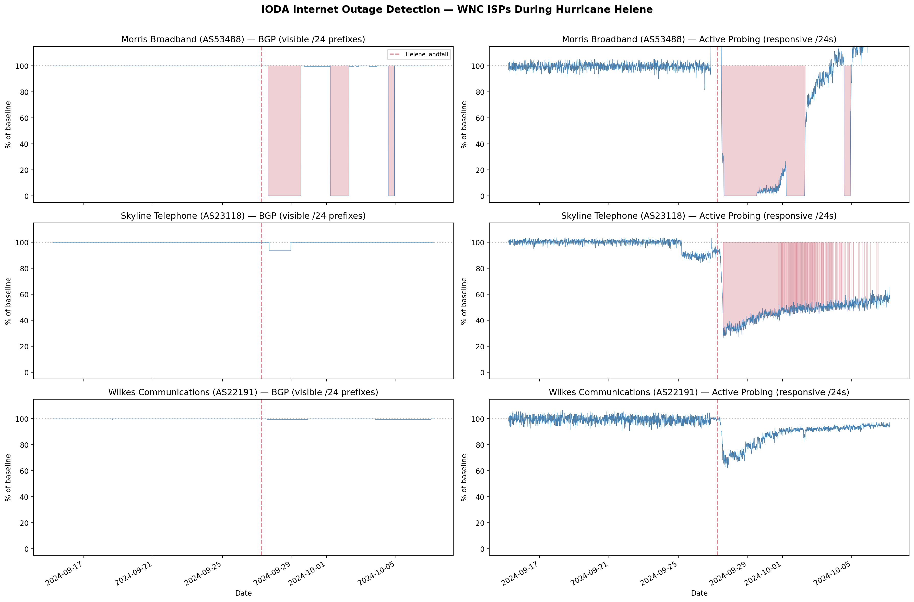
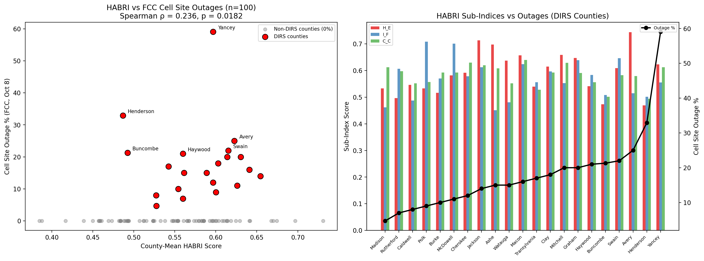
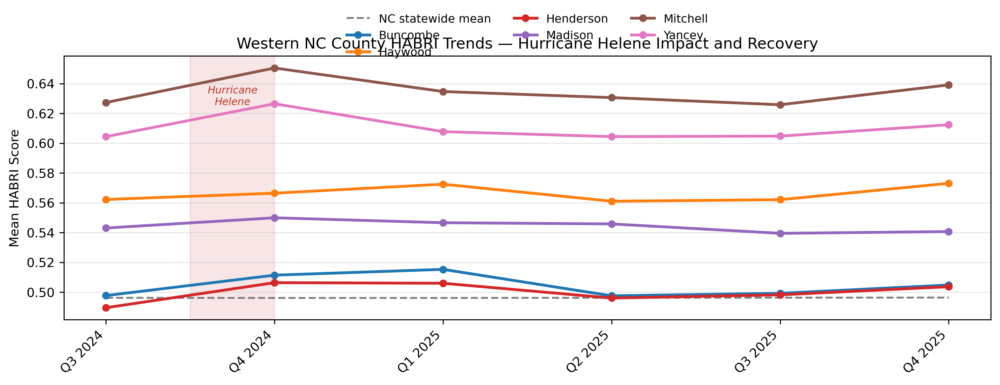
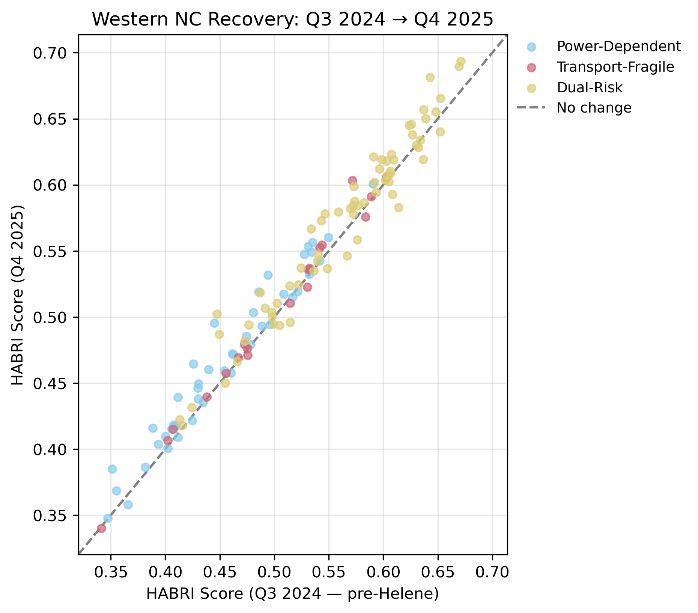
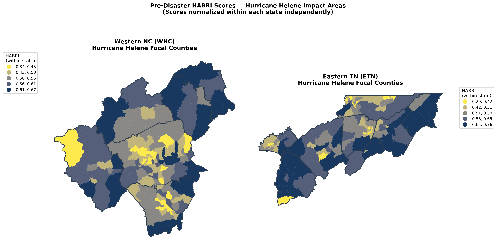

# HABRI — Hazard-Adjusted Broadband Reliability Index

**Identifying the communities most likely to lose phone and internet service during a natural disaster — before the next storm hits.**

> For a comprehensive overview of the project, methodology, and results, see the
> [HABRI Report (PDF)](docs/HABRI%20Report.pdf).

---

## The Problem

When Hurricane Helene struck Western North Carolina in September 2024, entire communities lost phone and internet service for days or weeks. Emergency calls couldn't go through. Families couldn't reach loved ones. Relief coordinators couldn't communicate with the people who needed help most.

The hardest-hit areas weren't random. They were communities where environmental hazards, fragile infrastructure, and socioeconomic vulnerability overlapped — places that were predictably at risk, if anyone had been looking.

**HABRI is that look.** It combines publicly available data on natural hazards, broadband infrastructure, and community demographics into a single score for every census tract in the study area. The goal: help planners, emergency managers, and policymakers direct resources — backup generators, fiber route improvements, mobile cell towers — to the places that need them most, *before* the next storm.

---

## Where We've Mapped

| Region | Coverage | Tracts |
|--------|----------|--------|
| **North Carolina** | All 100 counties | 2,660 |
| **Tennessee** | All 95 counties | 1,701 |
| **NC + TN Combined** | Shared standardized scale | 4,361 |

The methodology is designed to work for any U.S. state using the same freely available data sources.


*HABRI scores across North Carolina and Tennessee. Darker areas face higher risk of communications failure during a disaster. Yellow areas are lower risk.*

---

## How the Score Works

Every census tract gets a score between **0** (lowest risk) and **1** (highest risk). The score combines three dimensions:

```
HABRI = 40% Hazard Exposure + 35% Infrastructure Fragility + 25% Coping Capacity Deficit
```

### Hazard Exposure (40%)

*How likely is this area to experience a severe natural disaster?*

Uses FEMA's National Risk Index to measure exposure to **inland flooding** (40%), **hurricanes** (35%), and **landslides** (25%) — the three hazard types most relevant to broadband infrastructure in these regions.

### Infrastructure Fragility (35%)

*How vulnerable is the communications infrastructure itself?*

Measures the physical resilience of the broadband and cellular network through four indicators:

- **Cell tower density** — Fewer towers means less backup if one goes down
- **Broadband latency** — Higher baseline delay suggests overloaded or poorly maintained networks
- **Road network bottlenecks** — Where all traffic funnels through one road, fiber and cable running along that route are vulnerable too
- **Power grid exposure** — Sparse transmission lines mean longer, more storm-vulnerable distribution runs

### Coping Capacity Deficit (25%)

*How well can the community cope when service goes down?*

Uses U.S. Census data to identify populations disproportionately affected by outages: households without vehicles, those relying solely on mobile internet, people with disabilities, and communities with lower incomes and higher poverty rates.

---

## What We Found

### North Carolina Risk Landscape

HABRI scores across the 2,660 NC tracts range from 0.17 to 0.82. The highest-risk areas cluster in **rural eastern counties** (flood exposure, sparse infrastructure, high poverty) and **western mountain counties** (landslide risk, road bottlenecks, power dependence).


*Each panel shows a different dimension of risk. The bottom-right panel is the composite HABRI score that combines all three. Western NC counties outlined in black were most severely affected by Hurricane Helene.*

### Three Types of Vulnerable Communities

Statistical clustering reveals that vulnerable communities fall into three distinct profiles — each suggesting different investments:

| Profile | Share of Tracts | What It Means | What Would Help |
|---------|----------------|---------------|-----------------|
| **Power-Dependent** | 51% | Risk driven primarily by power grid vulnerability | Backup generators, battery storage, mobile cell-on-wheels |
| **Dual-Risk** | 40% | High vulnerability on both power and transport axes | Combined investment: generators + route redundancy |
| **Transport-Fragile** | 9% | Risk concentrated in road network bottlenecks | Fiber route diversification, microwave links, bridge hardening |

---

## Validated Against Hurricane Helene

The index isn't just theoretical. We tested it against real outage data from Hurricane Helene (September 2024) and found that **HABRI successfully predicted where the worst outages occurred**.

### Internet Provider Blackouts

Georgia Tech's IODA project tracked three Western NC internet providers through the storm:

- **Morris Broadband** (Henderson County) experienced 80 hours of complete blackout — their entire network disappeared from the global internet
- **Skyline Telephone** and **Wilkes Communications** maintained partial visibility but showed significant degradation

These providers serve areas HABRI identified as highest-risk.


*Internet outage monitoring data from Georgia Tech's IODA project. The red shaded area marks Hurricane Helene's landfall. Morris Broadband (top) went completely dark for over three days.*

### Cell Site Outages Match HABRI Predictions

The FCC activated emergency reporting for 21 western NC counties during Helene. Counties with higher HABRI scores had higher cell site outage rates (Spearman rho = 0.236, p = 0.018).


*Left: Each dot is one NC county. Counties with higher HABRI scores experienced more cell site outages during Helene. Right: HABRI sub-index breakdown for the 21 counties that reported outages.*

---

## Tracking Recovery Over Time

HABRI isn't just a one-time snapshot. Using quarterly broadband performance data, we track how communities recover after a disaster.

### Western NC: 15 Months After Helene


*HABRI scores for the six most-affected WNC counties over six quarters. The pink band marks Hurricane Helene. Most counties showed initial improvement but several remain elevated above the statewide average (dashed line) more than a year later.*

### Which Communities Recover Fastest?


*Each dot is a WNC census tract. Dots above the dashed line haven't fully recovered to their pre-Helene baseline. Dual-Risk tracts (yellow) tend to cluster above the line, indicating the slowest recovery.*

---

## Cross-State Comparison: Western NC vs. Eastern Tennessee

Hurricane Helene affected both sides of the Appalachian mountains. We built the same index for Tennessee to enable direct comparison.


*Pre-disaster HABRI scores for the areas most affected by Hurricane Helene. Both regions show pockets of high vulnerability, but the risk profiles differ — WNC has more transport-fragile tracts while Eastern TN has more power-dependent ones.*

---

## Data Sources

All data is publicly available and free to access:

| Source | What It Provides |
|--------|-----------------|
| [FEMA National Risk Index](https://hazards.fema.gov/nri/) | Flood, hurricane, and landslide risk scores |
| [HIFLD Open Data](https://hifld-geoplatform.hub.arcgis.com/) | Cell tower locations and electric transmission lines |
| [Ookla Open Data](https://www.ookla.com/ookla-for-good/open-data) | Broadband speeds and latency from real user tests |
| [FCC Broadband Data Collection](https://broadbandmap.fcc.gov/) | Fixed broadband availability by technology type |
| [U.S. Census ACS](https://www.census.gov/programs-surveys/acs) | Demographics: income, vehicles, disability, internet type |
| [OpenStreetMap](https://www.openstreetmap.org/) | Road network connectivity and routing |
| [IODA (Georgia Tech)](https://ioda.inetintelligence.org/) | Real-time internet outage monitoring |
| [FCC Disaster Reports](https://www.fcc.gov/general/disaster-information-reporting-system-dirs) | Cell site outage counts during declared disasters |

---

## Outputs

The analysis produces downloadable data files, interactive maps, and publication-quality figures:

- **CSV and GeoPackage files** — Tract-level HABRI scores, sub-indices, and vulnerability profiles for NC, TN, and the combined layer
- **Interactive web maps** — Open in any browser to explore tracts, hover for details, and toggle layers
- **Static maps** — Publication-ready four-panel choropleths and profile maps
- **Time-series charts** — Quarterly HABRI trends showing disaster impact and recovery
- **Streamlit dashboard** — Run `streamlit run app.py` for an interactive exploration tool

---

## Getting Started

### Explore the Results

The easiest way to explore HABRI is to open the interactive map:

1. Download or clone this repository
2. Open `data/processed/habri_map.html` in a web browser (NC) or `habri_nc_tn_standardized.html` (NC+TN)
3. Hover over any tract to see its HABRI score and risk profile

Or launch the dashboard:

```bash
pip install -r requirements.txt
streamlit run app.py
```

### Reproduce the Analysis

```bash
# Install dependencies
pip install -r requirements.txt

# Run the NC baseline notebooks in order (01 through 04)
jupyter notebook notebooks/01_data_acquisition.ipynb

# Build Tennessee
python scripts/build_habri_tn.py

# Build the combined NC+TN layer
python scripts/build_habri_nc_tn_combined.py
```

The full NC pipeline takes 2-4 hours from scratch (road network download and centrality computation are the bottlenecks). See the [Contributing Guide](docs/CONTRIBUTING.md) for detailed setup instructions.

---

## Documentation

| Document | Description |
|----------|-------------|
| [HABRI Report (PDF)](docs/HABRI%20Report.pdf) | Comprehensive report covering methodology, results, and policy implications |
| [HABRI Explained](docs/HABRI_EXPLAINED.md) | Plain-language summary for a general audience |
| [Methodology](docs/METHODOLOGY.md) | Complete formulas, statistical methods, and design decisions |
| [Data Dictionary](docs/DATA_DICTIONARY.md) | Column-by-column definitions for every data file |
| [Contributing](docs/CONTRIBUTING.md) | Developer setup and how to extend HABRI to new regions |

---

## Citation and License

This project uses open government data and open-source software. If you use HABRI in your work, please cite the data sources listed above and this repository.

**Ookla Data**: Speedtest by Ookla Global Fixed and Mobile Network Performance Maps. Based on analysis by Ookla of Speedtest Intelligence data. Provided under the Creative Commons Attribution-NonCommercial-ShareAlike 4.0 International License.

**IODA Data**: Internet Outage Detection and Analysis (IODA), Center for Applied Internet Data Analysis (CAIDA), Georgia Institute of Technology.

---

## Contact

For questions about the methodology, data, or potential applications of HABRI, please open an issue in this repository.
